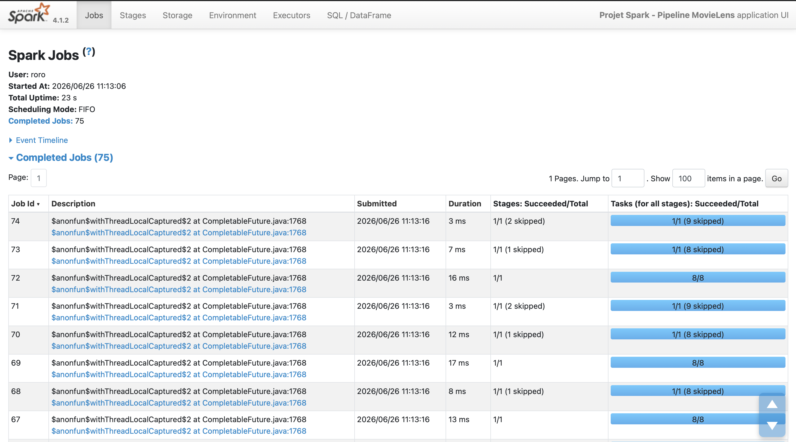
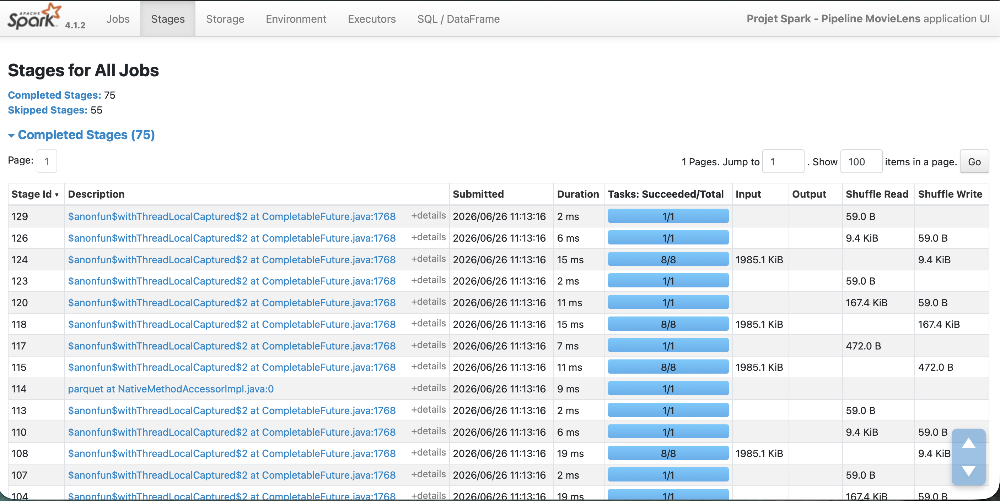
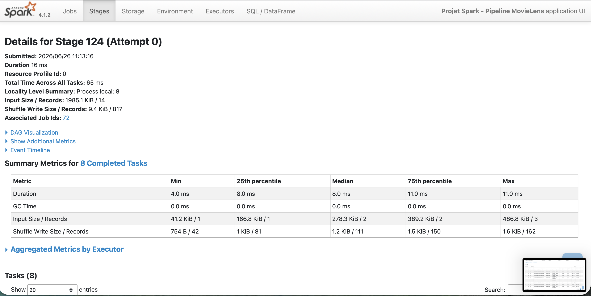
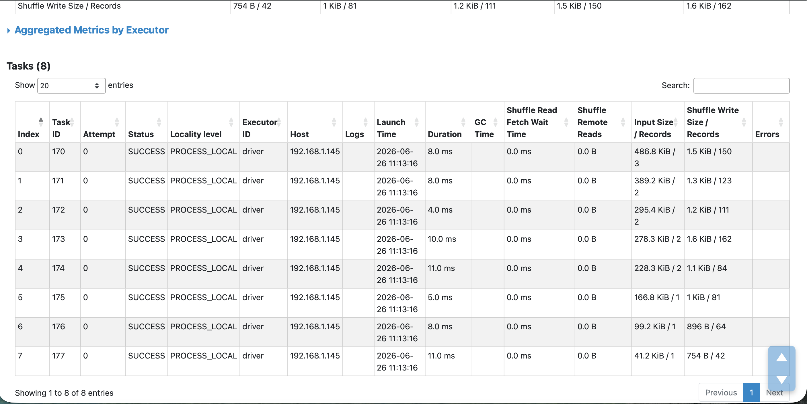
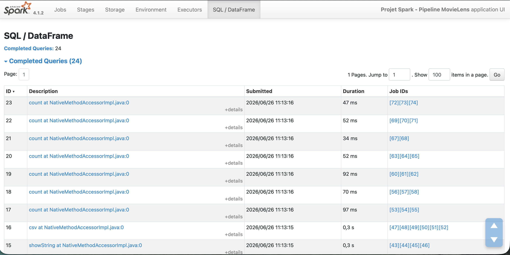

# Projet Spark — Pipeline MovieLens


Équipe : Rodrigue Harnais  

Jeu de données : MovieLens  

Date : 26/06/2026


## 1. Jeu de données et schéma cible

Nous avons choisi le jeu de données MovieLens small pour construire un pipeline Spark de bout en bout.

Les fichiers utilisés sont :

- `ratings.csv`, qui contient les notes attribuées par les utilisateurs aux films ;
- `movies.csv`, qui contient les informations sur les films, notamment le titre et les genres.

Le pipeline est exécuté en PySpark avec Spark 4.1.2, en mode local avec `local[*]`.


L’objectif est de construire un pipeline ETL complet :

- ingestion des fichiers CSV bruts ;
- nettoyage et typage des données ;
- écriture d’une couche silver au format Parquet ;
- production de résultats d’analyse dans une couche gold ;
- réalisation d’analyses métier ;
- test d’une optimisation Spark ;
- lecture de la Spark UI pour comprendre l’exécution.


## 2. Pipeline bronze -> silver -> gold

Le pipeline suit une architecture en trois étapes :

- **bronze** : lecture des fichiers CSV bruts avec un schéma explicite ;
- **silver** : nettoyage, typage et écriture des données propres au format Parquet ;
- **gold** : production de fichiers de synthèse pour les analyses métier.

Les fichiers sources utilisés sont :

- `ratings.csv`, qui contient les notes des utilisateurs ;
- `movies.csv`, qui contient les informations sur les films.

### Ingestion bronze

Les fichiers CSV sont lus avec un schéma explicite `StructType`. Cela permet d’éviter l’inférence automatique des types et de contrôler directement le schéma des données.

Le schéma utilisé pour `ratings.csv` est :

- `userId` : integer ;
- `movieId` : integer ;
- `rating` : double ;
- `timestamp` : long.

Le schéma utilisé pour `movies.csv` est :

- `movieId` : integer ;
- `title` : string ;
- `genres` : string.

Après lecture des fichiers bruts, le pipeline obtient :

- nombre de lignes `ratings` brut : 100836 ;
- nombre de lignes `movies` brut : 9742.

### Nettoyage silver

Les traitements appliqués sur `ratings` sont :

- suppression des doublons ;
- suppression des lignes avec valeurs manquantes sur `userId`, `movieId`, `rating` ou `timestamp` ;
- conservation uniquement des notes comprises entre `0.5` et `5.0` ;
- création de la colonne `rating_year` à partir du timestamp.

Les traitements appliqués sur `movies` sont :

- suppression des doublons sur `movieId` ;
- suppression des lignes sans `movieId` ou sans `title` ;
- suppression des titres vides ;
- transformation de la colonne `genres` en tableau `genres_array`.

Résultat du nettoyage :

- ratings supprimés : 0 ;
- movies supprimés : 0 ;
- nombre de lignes `ratings` silver : 100836.

Aucune ligne n’a été supprimée avec les règles retenues. Cela indique que le dataset MovieLens small est déjà propre pour ce projet.

La couche silver est écrite au format Parquet dans `output/silver/`.

La table `ratings` est partitionnée par `rating_year`, car cette colonne a une faible cardinalité et peut faciliter certaines lectures filtrées par année.

### Couche gold

La couche gold contient les résultats des analyses métier.

Les sorties produites sont :

- `output/gold/top_movies` ;
- `output/gold/genres_popularity` ;
- `output/gold/top_by_genre` ;
- `output/gold/users_activity`.


## 3. Analyses
### Analyse 1 - Agrégation

La première analyse répond à la question suivante :

**Quels sont les films les mieux notés parmi ceux qui ont reçu un nombre significatif de notes ?**

Pour éviter de classer des films ayant seulement quelques notes, un seuil minimum de 50 notes est appliqué.

Le calcul regroupe les notes par `movieId`, puis calcule :

- le nombre de notes par film ;
- la note moyenne ;
- le titre du film grâce à une jointure avec `movies`.

Code clé :

```python

ratings_by_movie = (

    ratings

    .groupBy("movieId")

    .agg(

        F.count("*").alias("nb_notes"),

        F.round(F.avg("rating"), 2).alias("note_moyenne")

    )

    .filter(F.col("nb_notes") >= 50)

)

```

Extrait du résultat obtenu :

| Film | Nombre de notes | Note moyenne |
|---|---:|---:|
| Shawshank Redemption, The (1994) | 317 | 4.43 |
| Godfather, The (1972) | 192 | 4.29 |
| Fight Club (1999) | 218 | 4.27 |
| Dr. Strangelove or: How I Learned to Stop Worrying and Love the Bomb (1964) | 97 | 4.27 |
| Cool Hand Luke (1967) | 57 | 4.27 |

Cette analyse montre que les films les mieux notés, avec au moins 50 notes, sont majoritairement des classiques du cinéma. Le seuil de 50 notes permet d’éviter de mettre en avant des films ayant une très bonne moyenne mais trop peu de votes.

### Analyse 2 - Jointure

La deuxième analyse répond à la question suivante :

**Quels genres de films concentrent le plus de notes et quelle est leur note moyenne ?**

Pour cette analyse, la colonne `genres_array` est explosée avec `explode`, afin d’obtenir une ligne par genre. Les données sont ensuite regroupées par genre.

Le calcul produit :

- le nombre de notes par genre ;
- le nombre de films distincts par genre ;
- la note moyenne par genre.

Code clé :

```python

genres_analysis = (

    ratings_movies

    .withColumn("genre", F.explode("genres_array"))

    .filter(F.col("genre") != "(no genres listed)")

    .groupBy("genre")

    .agg(

        F.count("*").alias("nb_notes"),

        F.countDistinct("movieId").alias("nb_films"),

        F.round(F.avg("rating"), 2).alias("note_moyenne")

    )

)

```

Extrait du résultat obtenu :

| Genre | Nombre de notes | Nombre de films | Note moyenne |
|---|---:|---:|---:|
| Drama | 41928 | 4349 | 3.66 |
| Comedy | 39053 | 3753 | 3.38 |
| Action | 30635 | 1828 | 3.45 |
| Thriller | 26452 | 1889 | 3.49 |
| Adventure | 24161 | 1262 | 3.51 |

Cette analyse montre que les genres les plus représentés dans les notes sont `Drama`, `Comedy`, `Action`, `Thriller` et `Adventure`.

Le genre `Drama` est celui qui concentre le plus grand nombre de notes, avec 41928 notes. En revanche, le genre le plus populaire en volume n’est pas forcément celui qui a la meilleure moyenne. Par exemple, `Comedy` a beaucoup de notes, mais une moyenne plus faible que `Drama`.

### Analyse 3 - Window function

La troisième analyse répond à la question suivante :

**Quels sont les trois meilleurs films pour chaque genre ?**

Cette analyse utilise une window function. Les films sont d’abord associés à leurs genres, puis classés à l’intérieur de chaque genre selon deux critères :

- la note moyenne décroissante ;
- le nombre de notes décroissant en cas d’égalité.

Code clé :

```python

window_genre = Window.partitionBy("genre").orderBy(

    F.desc("note_moyenne"),

    F.desc("nb_notes")

)

top_by_genre = (

    movie_scores_by_genre

    .withColumn("rang", F.row_number().over(window_genre))

    .filter(F.col("rang") <= 3)

)

```

La fonction `row_number()` permet ensuite de garder uniquement les trois premiers films de chaque genre.

Extrait du résultat obtenu :

| Genre | Film | Nombre de notes | Note moyenne | Rang |
|---|---|---:|---:|---:|
| Action | Fight Club (1999) | 218 | 4.27 | 1 |
| Action | Dark Knight, The (2008) | 149 | 4.24 | 2 |
| Action | Star Wars: Episode IV - A New Hope (1977) | 251 | 4.23 | 3 |
| Adventure | Star Wars: Episode IV - A New Hope (1977) | 251 | 4.23 | 1 |
| Adventure | Princess Bride, The (1987) | 142 | 4.23 | 2 |
| Adventure | Star Wars: Episode V - The Empire Strikes Back (1980) | 211 | 4.22 | 3 |
| Drama | Shawshank Redemption, The (1994) | 317 | 4.43 | 1 |
| Drama | Godfather, The (1972) | 192 | 4.29 | 2 |
| Drama | Fight Club (1999) | 218 | 4.27 | 3 |

Cette analyse permet d’obtenir un classement par segment, et non un simple classement global. Par exemple, *Fight Club* apparaît comme meilleur film du genre `Action`, tandis que *The Shawshank Redemption* arrive en première position pour le genre `Drama`.

La window function est utile ici car elle permet de calculer un rang indépendamment pour chaque genre.

### Analyse bonus — Utilisateurs les plus actifs

L’analyse bonus répond à la question suivante :

**Quels sont les utilisateurs les plus actifs sur la plateforme ?**

Cette analyse permet d’identifier les utilisateurs ayant laissé le plus grand nombre de notes dans le dataset. Les données sont regroupées par utilisateur, puis deux indicateurs sont calculés :

- le nombre total de notes laissées par utilisateur ;
- la note moyenne donnée par chaque utilisateur.

Code clé :

```python
users_activity = (
    ratings
    .groupBy("userId")
    .agg(
        F.count("*").alias("nb_notes"),
        F.round(F.avg("rating"), 2).alias("note_moyenne_utilisateur")
    )
    .orderBy(F.desc("nb_notes"))
)
```

Le tri décroissant sur `nb_notes` permet ensuite d’identifier les utilisateurs les plus actifs.

Extrait du résultat obtenu :

| userId | Nombre de notes | Note moyenne utilisateur |
|---:|---:|---:|
| 414 | 2698 | 3.39 |
| 599 | 2478 | 2.64 |
| 474 | 2108 | 3.40 |
| 448 | 1864 | 2.85 |
| 274 | 1346 | 3.24 |
| 610 | 1302 | 3.69 |
| 68 | 1260 | 3.23 |
| 380 | 1218 | 3.67 |
| 606 | 1115 | 3.66 |
| 288 | 1055 | 3.15 |

Cette analyse montre que certains utilisateurs sont beaucoup plus actifs que les autres. L’utilisateur 414 est celui qui a laissé le plus de notes, avec 2698 évaluations. On remarque également que le nombre de notes ne signifie pas forcément une note moyenne élevée. Par exemple, l’utilisateur 599 a laissé 2478 notes avec une moyenne de 2.64, ce qui indique un comportement de notation plus sévère.


## 4. Optimisation

L’optimisation testée est le **broadcast join**.

Dans notre pipeline, la table `movies` est beaucoup plus petite que la table `ratings`. Elle peut donc être envoyée en mémoire à chaque worker pour éviter une jointure plus coûteuse.

La comparaison a été faite entre :

- une jointure classique entre `ratings` et `movies` ;
- une jointure avec `broadcast(movies)`.

Résultat obtenu :

| Méthode | Nombre de lignes | Temps |
|---|---:|---:|
| Jointure sans broadcast | 100836 | 0.107 s |
| Jointure avec broadcast | 100836 | 0.082 s |

La jointure avec broadcast est plus rapide sur cette exécution. Le gain mesuré est faible car le dataset MovieLens small est léger et le pipeline tourne en local, mais le plan physique confirme bien l’utilisation du broadcast.

Dans le plan d’exécution, Spark utilise :

```text
BroadcastHashJoin
BroadcastExchange
```

Cela montre que Spark diffuse la table `movies` pour réaliser la jointure plus efficacement.


## 5. Lecture de la Spark UI

Pendant l’exécution du pipeline, la Spark UI a été ouverte à l’adresse `http://localhost:4040`.

### Vue Jobs



L’onglet Jobs montre que l’application Spark `Projet Spark - Pipeline MovieLens` a exécuté 75 jobs. Ces jobs correspondent aux actions déclenchées dans le script : `count()`, `show()`, les écritures Parquet/CSV et les analyses.

### Vue Stages



L’onglet Stages montre 75 stages terminés et 55 stages ignorés. On observe aussi des colonnes `Shuffle Read` et `Shuffle Write`, ce qui confirme que certaines opérations ont provoqué du shuffle, notamment les agrégations, les tris et les window functions.

### Détail d’un stage



Dans le détail du stage 124, on observe :

- durée : 16 ms ;
- 8 tasks terminées ;
- input : 1985.1 KiB / 14 records ;
- shuffle write : 9.4 KiB / 817 records.

Ce stage illustre la manière dont Spark découpe le travail en plusieurs tasks et redistribue une partie des données via le shuffle.

### Détail des tasks



La vue des tasks montre que les 8 tasks se sont terminées avec succès. Les durées sont faibles, car le dataset MovieLens small est léger et l’exécution se fait en mode local.

### Vue SQL / DataFrame



L’onglet SQL/DataFrame montre 24 requêtes terminées. On y retrouve les actions DataFrame comme `count()`, `show()` et les écritures CSV, avec leurs durées et les Job IDs associés.


## 6. Exploration au-delà du cours

Pour l’exploration au-delà du cours, nous avons choisi de mesurer l’effet du nombre de partitions de shuffle sur une agrégation.

L’objectif est de comparer le temps d’exécution d’une même analyse en changeant uniquement la configuration Spark suivante :

```python
spark.conf.set("spark.sql.shuffle.partitions", str(partitions))
```

Le test est réalisé sur une agrégation par genre, qui utilise un `groupBy` et provoque donc du shuffle.

Trois valeurs ont été testées :

| Nombre de partitions de shuffle | Temps |
|---:|---:|
| 4 | 0.199 s |
| 8 | 0.122 s |
| 16 | 0.129 s |

Le meilleur temps observé est obtenu avec 8 partitions de shuffle.

Avec seulement 4 partitions, le temps est plus élevé, car le travail est réparti sur moins de partitions. Avec 16 partitions, le temps reste proche de celui obtenu avec 8 partitions, mais il n’est pas meilleur. Sur ce dataset léger, augmenter le nombre de partitions au-delà d’un certain point n’apporte pas de gain.

Cette exploration montre que le nombre de partitions de shuffle peut influencer les performances, même en mode local. Le bon réglage dépend du volume de données, du nombre de cœurs disponibles et du type d’opération exécutée.

### Complément — Effet du cache

Nous avons aussi mesuré l’effet du cache sur un DataFrame réutilisé plusieurs fois.

| Méthode | Temps |
|---|---:|
| Sans cache | 0.174 s |
| Avec cache | 0.120 s |

Le cache améliore légèrement le temps d’exécution. Le gain reste limité car le dataset est petit et l’exécution se fait en local, mais il montre l’intérêt de mettre en cache un DataFrame réutilisé plusieurs fois.

## 7. Ce qu’on a appris et limites

### Ce qui a marché

Le pipeline Spark a permis de traiter le dataset MovieLens de bout en bout :

- lecture des fichiers CSV bruts avec un schéma explicite ;
- nettoyage et typage des données ;
- écriture d’une couche silver au format Parquet ;
- production de résultats gold au format CSV ;
- réalisation de trois analyses métier ;
- ajout d’une analyse bonus sur les utilisateurs les plus actifs ;
- test d’une optimisation avec broadcast join ;
- observation de l’exécution avec la Spark UI.

### Ce qui a bloqué ou limité l’analyse

Le projet a été réalisé avec le dataset MovieLens small, qui contient un volume de données limité. Les traitements Spark s’exécutent donc rapidement, ce qui rend certaines optimisations moins visibles que sur un dataset plus volumineux.

Le pipeline a aussi été exécuté en mode local avec `local[*]`, et non sur un cluster distribué. Les mesures de performance dépendent donc de la machine utilisée, du cache système et de l’état de la session Spark.

### Ce qu’on ferait avec plus de temps

Avec plus de temps, il serait intéressant de :

- tester le pipeline sur un dataset plus volumineux ;
- comparer les performances entre CSV et Parquet ;
- analyser l’évolution des notes dans le temps ;
- étudier plus finement le comportement des utilisateurs ;
- exécuter le pipeline avec `spark-submit` ;
- tester davantage les paramètres Spark comme l’AQE ou le nombre de partitions.